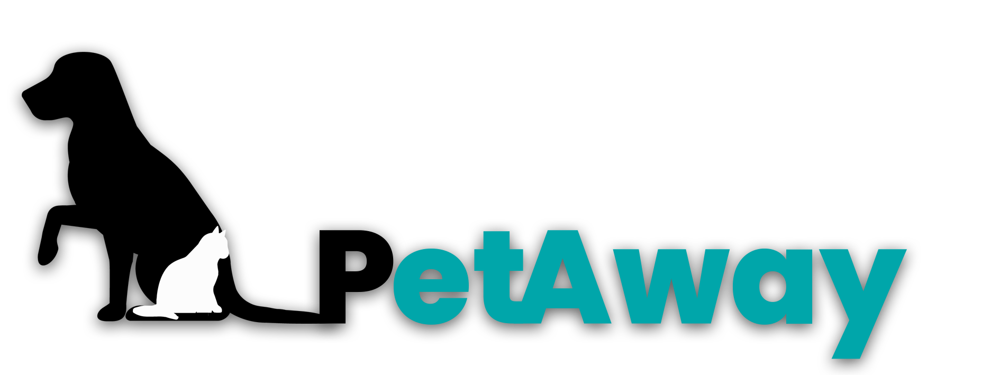
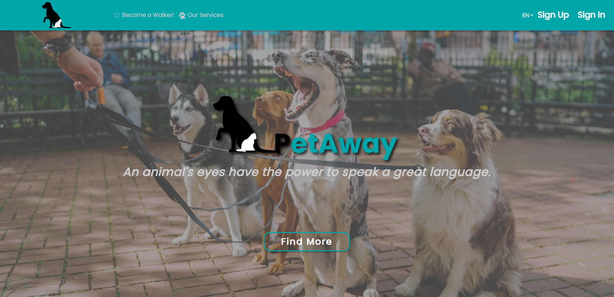

<div id="top"></div>

[![Contributors][contributors-shield]][contributors-url]
[![Forks][forks-shield]][forks-url]
[![Stargazers][stars-shield]][stars-url]
[![Issues][issues-shield]][issues-url]
[![MIT License][license-shield]][license-url]

<br />
<div align="center">
  <a href="https://github.com/LuisLeandro94/petaway_frontend">
    
  </a>

<h3 align="center">PetAway Frontend</h3>

  <p align="center">
    A software for the best Pet Owners.
    <br />
    <a href="https://documenter.getpostman.com/view/14342837/UVXkoF1X"><strong>Explore the docs »</strong></a>
    <br />
    <br />
    <a href="https://petaway-dwm.herokuapp.com/">View Live Version</a>
    ·
    <a href="https://github.com/LuisLeandro94/petaway_frontend/issues">Report Bug</a>
    ·
    <a href="https://github.com/LuisLeandro94/petaway_frontend/issues">Request Feature</a>
  </p>
</div>


<!-- TABLE OF CONTENTS -->
<details>
  <summary>Table of Contents</summary>
  <ol>
    <li>
      <a href="#about-the-project">About The Project</a>
      <ul>
        <li><a href="#built-with">Built With</a></li>
      </ul>
    </li>
    <li>
      <a href="#getting-started">Getting Started</a>
      <ul>
        <li><a href="#prerequisites">Prerequisites</a></li>
        <li><a href="#installation">Installation</a></li>
      </ul>
    </li>
    <li><a href="#license">License</a></li>
    <li><a href="#contact">Contact</a></li>
  </ol>
</details>


<!-- ABOUT THE PROJECT -->
## About The Project

[](https://petaway-dwm.herokuapp.com/)

When you need somewhere to take care of your pet while you are gone what do you do? Family? We all know that is not always an option. That's where PetAway comes into play. Just open our software, sign up, and start searching for the best pet-walkers and pet-sitters in your area. Treat your pets with only the best quality services!

<p align="right">(<a href="#top">back to top</a>)</p>


### Built With

* [React.js](https://reactjs.org/)
* [Styled-Components](https://styled-components.com/)
* [Ant Design](https://ant.design/)
* [GMaps API](https://developers.google.com/maps)

<p align="right">(<a href="#top">back to top</a>)</p>


<!-- GETTING STARTED -->
## Getting Started

To get a local copy up and running follow these simple example steps.

### Prerequisites

Make sure you have the latest npm version running on your machine.
* npm
  ```sh
  npm install npm@latest -g
  ```

### Installation

1. Clone the repo
   ```sh
   git clone https://github.com/LuisLeandro94/petaway_frontend.git
   ```
2. Clone the API repo
   ```sh
   git clone https://github.com/LuisLeandro94/petaway-backend.git
   ```
3. Get the API up and running following the steps over in `PetAway-Backend`
   ```sh
   https://github.com/LuisLeandro94/petaway-backend.git
   ```
5. Install NPM packages
   ```sh
   npm install
   ```
   or
   ```sh
   npm i
   ```
4. Run the app
   ```sh
   npm start
   ```

<p align="right">(<a href="#top">back to top</a>)</p>

<!-- LICENSE -->
## License

Distributed under the MIT License. See `LICENSE.txt` for more information.

<p align="right">(<a href="#top">back to top</a>)</p>


<!-- CONTACT -->
## Contact

Project Link: [Frontend](https://github.com/LuisLeandro94/petaway_frontend)
Backend Link: [Backend](https://github.com/LuisLeandro94/petaway-backend)

<p align="right">(<a href="#top">back to top</a>)</p>


<!-- MARKDOWN LINKS & IMAGES -->
<!-- https://www.markdownguide.org/basic-syntax/#reference-style-links -->
[contributors-shield]: https://img.shields.io/github/contributors/LuisLeandro94/petaway_frontend.svg?style=for-the-badge
[contributors-url]: https://github.com/LuisLeandro94/petaway_frontend/graphs/contributors
[forks-shield]: https://img.shields.io/github/forks/LuisLeandro94/petaway_frontend.svg?style=for-the-badge
[forks-url]: https://github.com/LuisLeandro94/petaway_frontend/network/members
[stars-shield]: https://img.shields.io/github/stars/LuisLeandro94/petaway_frontend.svg?style=for-the-badge
[stars-url]: https://github.com/LuisLeandro94/petaway_frontend/stargazers
[issues-shield]: https://img.shields.io/github/issues/LuisLeandro94/petaway_frontend.svg?style=for-the-badge
[issues-url]: https://github.com/LuisLeandro94/petaway_frontend/issues
[license-shield]: https://img.shields.io/github/license/LuisLeandro94/petaway_frontend.svg?style=for-the-badge
[license-url]: https://github.com/LuisLeandro94/petaway_frontend/blob/master/LICENSE.txt
[linkedin-shield]: https://img.shields.io/badge/-LinkedIn-black.svg?style=for-the-badge&logo=linkedin&colorB=555
[linkedin-url]: https://linkedin.com/in/linkedin_username
[product-screenshot]: images/screenshot.png
